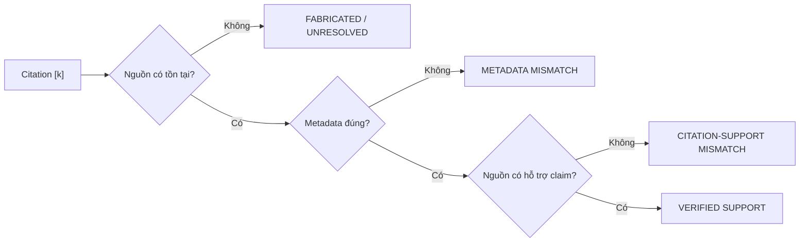
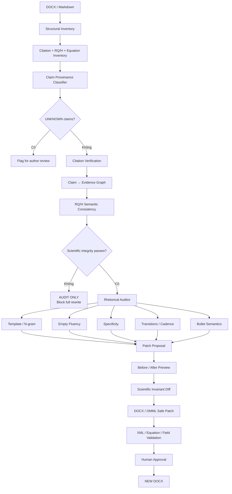
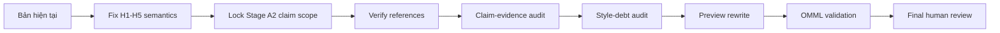

# Cập nhật AI Agent Skill chống AI-slop cho báo cáo nghiên cứu khoa học theo Tạp chí An toàn thông tin

## Tóm tắt điều hành

Bài *“AI slop hay rác AI: Từ hiện tượng ngôn ngữ đến rủi ro an ninh mạng”* của Khúc Hữu Hùng, đăng trên *Tạp chí An toàn thông tin* ngày 19/08/2026, buộc phải thay đổi đáng kể cách thiết kế Skill trước đây. Bài viết chỉ ra một điểm rất quan trọng: **AI slop không đồng nghĩa với “văn bản do AI tạo”**. Vấn đề nằm ở nội dung trôi chảy nhưng rỗng, lặp khuôn, thiếu người chịu trách nhiệm kiểm chứng và đặc biệt là chuyển gánh nặng xác minh sang người đọc. Bài báo khái quát ba đặc trưng là trôi chảy nhưng thiếu thực chất, văn phong lặp lại và vắng chủ thể chịu trách nhiệm; trong nghiệp vụ an ninh mạng, các biểu hiện cụ thể còn gồm viện dẫn không tồn tại, trích dẫn sai, dấu vết sản xuất hàng loạt, kết luận vượt quá bằng chứng và mô tả thiếu đặc thù của môi trường thực tế. citeturn1search0

Điểm này phù hợp với cách Simon Willison dùng thuật ngữ “slop”: trọng tâm không phải cấm dùng LLM mà là **không công bố nội dung tự động mà bản thân người công bố chưa kiểm tra và chưa sẵn sàng chịu trách nhiệm**. Willison thậm chí xem việc gắn tên mình với nội dung xuất bản là một cam kết về uy tín cá nhân. citeturn2search6turn2search5

Bằng chứng thực tế từ hệ sinh thái bảo mật cho thấy đây không phải một vấn đề thẩm mỹ. Daniel Stenberg báo cáo khoảng 20% security submission gửi tới curl trong năm 2025 thuộc nhóm AI slop trong khi chỉ khoảng 5% submission trở thành lỗ hổng thực; mỗi báo cáo vẫn buộc nhiều thành viên đội bảo mật bỏ thời gian xác minh. citeturn2search0 Bugcrowd sau đó ghi nhận triage queue tăng 334% trong ba tuần do lượng lớn báo cáo chất lượng thấp, bằng chứng mỏng và thiếu validation; nền tảng này đã phải bổ sung kiểm soát submission, xác minh danh tính và chế tài đối với submission farming. citeturn2search1turn2search2turn2search8 Seth Larson cũng nhấn mạnh rằng báo cáo an ninh chưa được con người kiểm chứng không nên được chuyển chi phí xác minh sang maintainer nguồn mở. citeturn2search11

Đối với báo cáo nghiên cứu khoa học, hệ quả là Skill **không thể chỉ là một style linter** kiểm tra “Về mặt”, “Nhằm”, bullet hoặc độ dài câu. Nó phải trở thành một **scientific-integrity editor** gồm ba lớp:

| Lớp | Skill cũ tập trung | Skill v2.2 phải bổ sung |
|---|---|---|
| **Scientific invariants** | Không làm đổi claim, citation, số liệu, equation | Citation existence, citation–claim support, claim provenance, hypothesis/RQ consistency, conclusion–evidence proportionality |
| **Rhetorical auditor** | Template, opener, transition, bullet, cadence | “Fluent but empty”, specificity anchors, ownerless claims, inflated technical prose, local mass-production patterns |
| **DOCX/OMML safety** | Bảo vệ equation/XML | Giữ nguyên, nhưng mọi patch phải qua scientific-integrity gate trước khi chạm XML |

Quan trọng hơn, audit trực tiếp bản **`Chuyên đề chuyên sâu(8).docx` mới nhất hiện có trong phiên này** phát hiện một lỗi nghiêm trọng hơn hẳn chuyện “Về mặt”: **H1–H5 bị thay đổi ý nghĩa giữa Chương 2 và Chương 3**. Trong Chương 2, H1–H5 lần lượt xoay quanh fidelity tham số, multi-view alignment, anti-drift/shortcut robustness, bounded operational budget và utility–privacy frontier; nhưng Mục 3.3.2 lại dùng chính các ID H1–H5 cho representation quan hệ cấu trúc, độ nhạy thời gian, gióng hàng đa góc nhìn, hiệu năng tài nguyên và độ bất định khởi tạo. Đây không phải lỗi văn phong mà là **hypothesis drift**, làm đứt traceability của nghiên cứu. fileciteturn0file0

Vì vậy, tôi đã nâng Skill lên **v2.2** và đặt tài liệu hiện tại ở trạng thái:

> **`FAIL_FOR_REWRITE_APPLY`**

Tức là được phép `AUDIT_ONLY`, `VERIFY_REFERENCES` và `PREVIEW_REWRITE`, nhưng **chưa nên cho Agent humanize/rewrite toàn văn** trước khi sửa semantic mapping H1–H5 và khóa phạm vi các claim thực nghiệm. Đây chính là cách áp dụng tinh thần của bài AI-slop: đừng làm một tài liệu “nghe hay hơn” trước khi chắc rằng nội dung bên trong thực sự đúng và có thể kiểm chứng. citeturn1search0turn2search2

Bộ Skill mới:

[**Tải ATTT Scientific Prose Auditor v2.2 — SKILL.md**](sandbox:/mnt/data/ATTT_Scientific_Prose_Auditor_v2_2_SKILL.md)

[**Tải rule-set máy đọc được — JSON**](sandbox:/mnt/data/attt_style_rules_v2_2.json)

[**Tải audit riêng cho Chuyên đề chuyên sâu(8)**](sandbox:/mnt/data/AUDIT_Chuyen_de_chuyen_sau_8_AI_SLOP.md)

[**Tải toàn bộ bundle v2.2**](sandbox:/mnt/data/ATTT_Scientific_Prose_Auditor_v2_2_bundle.zip)

GPT‑5.6 Sol phù hợp với kiến trúc này vì OpenAI công bố Sol là flagship GPT‑5.6 cho coding, knowledge work, cybersecurity và science; GPT‑5.6 cũng có khả năng thực hiện các workflow phối hợp công cụ và xử lý kết quả trung gian, vì vậy pipeline tách `inventory → audit → verification → preview patch → validation` có thể được triển khai như một workflow agent thay vì một prompt rewrite đơn lượt. citeturn8search0

## Điều bài AI-slop làm thay đổi trong định nghĩa “văn AI” của Skill

Sai lầm lớn nhất của một “AI-humanizer” thông thường là xem dấu hiệu bề mặt như nguyên nhân:

> “Văn AI hay dùng `Về mặt` → xóa `Về mặt`.”

> “AI hay dùng bullet → chuyển toàn bộ bullet thành paragraph.”

> “AI hay dùng `Tuy nhiên` → thay bằng từ đồng nghĩa.”

> “Câu AI quá đều → ngẫu nhiên hóa độ dài câu.”

Cách tiếp cận đó thậm chí có thể **tạo ra một lớp slop mới**: câu chữ trông đa dạng hơn nhưng chất lượng tri thức không tăng.

Chính bài ATTT đang được phân tích là một phản ví dụ. Tác giả vẫn dùng “Về AI slop”, “Thứ nhất… Thứ năm…”, danh sách dấu hiệu và cấu trúc phân nhóm. Những cấu trúc đó hợp lý vì đối tượng đang được phân loại thực sự gồm các nhóm rủi ro và dấu hiệu khác nhau. citeturn1search0

Do đó Skill v2.2 áp dụng nguyên tắc:

> **Không audit token; audit chức năng của token trong lập luận.**

### Từ “trôi chảy nhưng trống rỗng” đến `EMPTY_FLUENCY`

Một paragraph không bị đánh dấu chỉ vì nó viết trôi chảy. Nó trở thành candidate `EMPTY_FLUENCY` khi đồng thời có ba điều kiện:

```text
strong/evaluative claim
        +
low technical specificity
        +
no identifiable evidence anchor
```

Ví dụ:

**Trước**

> Phương pháp đề xuất có khả năng biểu diễn toàn diện thông tin an ninh và mang lại hiệu quả cao trong môi trường thực tế.

Câu này nghe khoa học nhưng gần như không nói được điều gì kiểm chứng được. “Toàn diện”, “hiệu quả cao”, “môi trường thực tế” đều là từ đánh giá nhưng không cho biết metric, dataset, baseline, experiment hay điều kiện triển khai.

Nếu có bằng chứng:

**Sau**

> Trên tập HDFS, nhánh đồ thị giảm mất mát dự đoán quan hệ trong quá trình tiền huấn luyện. Kết quả này phản ánh năng lực học tác vụ tự giám sát đang đo; nó chưa đủ để kết luận hiệu năng phát hiện tấn công downstream.

Nếu **không** có bằng chứng, Agent không được sáng tác con số, benchmark hoặc citation để làm câu “cụ thể hơn”. Nó phải trả về:

```yaml
finding: EMPTY_FLUENCY
action: REQUEST_EVIDENCE_OR_NARROW_CLAIM
rewrite_allowed: false
```

Đây là thay đổi cực kỳ quan trọng. BetterUp/Stanford mô tả “workslop” theo logic tương tự: sản phẩm có vẻ hoàn chỉnh và trau chuốt nhưng đẩy phần suy nghĩ và hoàn thiện thực sự sang người nhận. citeturn3search0turn3search2

### Từ “vắng chủ thể chịu trách nhiệm” đến `CLAIM_PROVENANCE`

Skill cũ chủ yếu nhìn grammatical subject. Điều đó chưa đủ.

Câu:

> “Nghiên cứu cho thấy…”

có chủ ngữ ngữ pháp nhưng vẫn có thể **vắng chủ thể tri thức** nếu không biết “nghiên cứu” nào, dữ liệu nào hoặc phép đo nào.

V2.2 buộc mọi câu chứa substantive claim được gán một trạng thái:

```text
CITED_LITERATURE
AUTHOR_PROPOSAL
OBSERVED_RESULT
DERIVED_RESULT
ASSUMPTION
LIMITATION
REQUIREMENT
INTERPRETATION
UNKNOWN
```

Chẳng hạn:

> “Arp et al. [8] chỉ ra…”  
→ `CITED_LITERATURE`

> “Chuyên đề đề xuất cơ chế…”  
→ `AUTHOR_PROPOSAL`

> “Seed 7 đạt val loss 0,550259…”  
→ `OBSERVED_RESULT`

> “Sự khác biệt có thể bắt nguồn từ trạng thái khởi tạo…”  
→ `INTERPRETATION`

> “Dữ liệu hiện tại chưa đủ để xác định nguyên nhân…”  
→ `LIMITATION`

> “Có thể thấy rằng phương pháp phù hợp cho SOC…”  
→ có nguy cơ `UNKNOWN`.

`UNKNOWN` không được “viết đẹp lại”. Nó phải trở thành finding.

### Từ “viện dẫn không có thật” đến hai tầng kiểm tra citation

Bài ATTT nhấn mạnh cả viện dẫn giả lẫn trích dẫn sai. citeturn1search0 Hai vấn đề này khác nhau:



Một paper **có thật** không đồng nghĩa citation đúng.

Đây là vấn đề đặc biệt quan trọng trong khoa học. Các nghiên cứu gần đây đã chỉ ra citation hallucination là một failure mode có thể đo được ở quy mô lớn; *GhostCite* chẳng hạn xây dựng hẳn CiteVerifier để phân biệt citation tồn tại và citation giả, còn nghiên cứu ACL 2026 *HalluCitation Matters* phát hiện hàng trăm paper trong corpus ACL/NAACL/EMNLP 2024–2025 chứa ít nhất một hallucinated citation. citeturn7academia24turn7search15 Các nghiên cứu trước đó cũng ghi nhận LLM có thể sinh bibliographic reference hoàn toàn hoặc một phần không chính xác. citeturn7search1

Vì vậy `VERIFY_REFERENCES` trong Skill mới không được làm kiểu:

```python
if google_search(title):
    status = "OK"
```

mà phải tách:

```yaml
existence:
metadata_match:
claim_support:
verification_source:
verification_date:
confidence:
```

### Từ “kết luận không tương xứng bằng chứng” đến claim–evidence graph

Đây là điểm quan trọng nhất đối với **Chuyên đề chuyên sâu**.

Skill phải truy vết:

```text
CLAIM
  ↓
EVIDENCE
  ↓
INTERPRETATION
  ↓
SCOPE / LIMIT
```

Nếu thiếu mắt xích, Agent phải cảnh báo trước khi chỉnh văn.

Ví dụ:

```text
VRAM < 550 MB
     ↓
cấu hình hiện tại chạy được trong giới hạn GPU thử nghiệm
     ↓
[KHÔNG SUY RA]
     ↓
hệ thống đáp ứng triển khai streaming SOC
```

Muốn đi đến kết luận cuối cần thêm ít nhất latency, throughput, memory-state growth và điều kiện workload thích hợp.

Bản hiện tại thực ra đã có một câu rất tốt về vấn đề này: phần đánh giá H4 thừa nhận rằng mức sử dụng bộ nhớ chỉ “gợi ý tiềm năng bước đầu” và cần thêm phép đo streaming latency/throughput trước khi kết luận khả năng triển khai SOC. fileciteturn0file0 Skill phải **khóa câu caveat đó như một scientific invariant**, chứ tuyệt đối không được humanize thành một tuyên bố mạnh hơn.

## Audit mới đối với “Chuyên đề chuyên sâu” theo khung AI-slop

Khi áp khung của bài báo mới vào `Chuyên đề chuyên sâu(8).docx`, vấn đề được phân tầng khác hẳn một style audit thông thường. fileciteturn0file0

### Lỗi ưu tiên cao nhất không phải văn phong: H1–H5 bị semantic drift

Ở Chương 2, tài liệu định nghĩa:

| ID | Ý nghĩa ban đầu |
|---|---|
| H1 | **Parameter Semantic Fidelity** |
| H2 | **Multi-View Alignment & Negative Transfer Prevention** |
| H3 | **Anti-Drift & Shortcut Invariance Robustness** |
| H4 | **Bounded Operational Budget Feasibility** |
| H5 | **Controlled Linkability & Utility–Privacy Frontier** |

Nhưng đến Mục 3.3.2, chính các ID đó lại được diễn giải thành:

| ID | Ý nghĩa tại phần kiểm chứng |
|---|---|
| H1 | Năng lực biểu diễn quan hệ cấu trúc |
| H2 | Độ nhạy thời gian liên tục |
| H3 | Gióng hàng đa góc nhìn |
| H4 | Hiệu năng tính toán luồng |
| H5 | Độ bất định khởi tạo trọng số |

Hai bảng **không tương đương về ngữ nghĩa**. Chẳng hạn H5 ban đầu là utility–privacy frontier nhưng H5 ở Chương 3 trở thành sensitivity đối với random initialization. H1 ban đầu hỏi về preservation của dynamic parameters nhưng phần thực nghiệm lại xem loss dự đoán relation như kiểm chứng H1. fileciteturn0file0

Đây chính xác là loại lỗi mà một humanizer thông thường bỏ qua vì câu chữ vẫn rất “khoa học”.

V2.2 do đó đưa:

```yaml
hypothesis_id_semantic_consistency: PASS_REQUIRED
```

thành **hard gate**.

Không được rewrite stylistic toàn văn khi gate này đang fail.

### Template debt thật sự tập trung ở các cụm, không phủ toàn tài liệu

Phép đo trước trên file này cho thấy `Về mặt`, `Nhằm`, `Tuy nhiên`, `Đồng thời` có xuất hiện nhiều lần, nhưng phân bố không chứng minh toàn bộ 91 trang đều được viết bằng cùng một khuôn. Vấn đề rõ nhất nằm ở **local clustering**. fileciteturn0file0

Ví dụ Kết luận:

> “1. Về mặt khảo sát…”

> “2. Về mặt phương pháp luận…”

> “3. Về mặt thực nghiệm…”

là một lỗi cấu trúc thật sự. fileciteturn0file0

Không nên sửa thành:

> “Ở khía cạnh khảo sát…”

> “Xét trên phương diện phương pháp luận…”

> “Đối với thực nghiệm…”

Đó chỉ là **synonym laundering**.

Logic nên trở thành dạng:

> Chương 1 xác lập phạm vi của bài toán và những giới hạn của các nhóm phương pháp hiện có. Các khoảng trống này dẫn trực tiếp tới kiến trúc được xây dựng ở Chương 2, trong đó nhánh biểu diễn đồ thị theo thời gian là thành phần đã được đưa vào thực nghiệm ở giai đoạn hiện tại. Kết quả Chương 3 cung cấp bằng chứng bước đầu cho nhánh này, đồng thời cho thấy các thành phần đa góc nhìn, đánh giá downstream và các giả thuyết chưa được kiểm chứng vẫn cần được tách rõ khỏi phần kết luận thực nghiệm.

Đây là **ví dụ về restructuring**, không phải đề nghị chép nguyên văn vào báo cáo. Trước hết H1–H5 phải được sửa.

### Có dấu hiệu “inflated technical prose” cần giảm

Trong tài liệu hiện tại, các từ như `tường minh`, `chặt chẽ`, `cốt lõi`, `tuyệt đối`, `nghiêm ngặt`, `toàn diện`, `then chốt` xuất hiện nhiều lần. fileciteturn0file0 Chúng không sai; chính ATTT cũng sử dụng các tính từ đánh giá khi có ngữ cảnh phù hợp. Vấn đề xuất hiện khi adjective thay thế specification.

So sánh:

**Yếu**

> Quy trình kiểm toán được thực hiện một cách chặt chẽ và toàn diện.

**Mạnh hơn về khoa học**

> Mỗi đợt chạy được đối chiếu với manifest tiền thi hành, commit, cấu hình scheduler và trạng thái mở tập Test.

Câu thứ hai không cần tự tuyên bố “chặt chẽ”; **cơ chế kiểm toán tự chứng minh mức độ chặt chẽ**.

Đây là một rule mới của Skill:

```text
SHOW CONTROL, DO NOT LABEL CONTROL
```

Tương tự:

> “bảo đảm tuyệt đối không rò rỉ”

nên được audit nghiêm ngặt hơn:

> “pipeline không fit tokenizer hoặc thống kê trên Validation/Test theo control X”

nếu đó mới là điều bằng chứng thực sự chứng minh.

### Phần thực nghiệm có một số đoạn tốt và phải được khóa

Không nên hiểu audit này là tài liệu đang “toàn AI slop”.

Ngược lại, một số đoạn thực nghiệm thể hiện đúng tinh thần chống slop. Ví dụ khi Seed 42 có trajectory bất thường, báo cáo nói dữ liệu hiện có **chưa đủ để xác định nguyên nhân nội tại**, thay vì bịa ra saddle point hay gradient failure. fileciteturn0file0

Đây là kiểu câu phải đánh dấu:

```yaml
claim_provenance: LIMITATION
preserve_priority: CRITICAL
rewrite_strength: NONE_OR_MINIMAL
```

Tương tự, việc công khai các seed lệch protocol thay vì xóa kết quả bất lợi là một điểm tốt về traceability trong chính tài liệu. fileciteturn0file0

Nguyên tắc của v2.2 vì vậy là:

> **Không “humanize” những đoạn khoa học đang tốt chỉ để toàn tài liệu có một giọng văn mới.**

### Citation [32] minh họa vì sao phải tách “tồn tại” và “bibliography quality”

Danh mục hiện ghi tương đối tối giản:

> T. T. T. Nguyễn, *“Phát hiện tấn công APT dựa trên Graph Learning,”* 2026.

Nguồn này **có tồn tại**: Tạp chí ATTT đăng *“Phát hiện tấn công APT dựa trên Graph Learning (Phần 1)”* ngày 10/03/2026 của ThS. Nguyễn Thị Thu Thủy, Học viện Kỹ thuật mật mã, và tiếp tục đăng Phần 2 ngày 13/03/2026. citeturn6search0turn6search1

Nhưng bibliography của báo cáo chưa thể hiện rõ phần nào đang được trích. Vì vậy trạng thái tốt hơn là:

```yaml
existence: VERIFIED
metadata_match: PARTIAL
claim_support: REQUIRES_CLAIM_LEVEL_CHECK
action: NORMALIZE_BIBLIOGRAPHY_METADATA
```

chứ không phải:

```yaml
citation: OK
```

Đó là khác biệt giữa **reference checker** và **scientific citation auditor**.

## Đặc tả Skill v2.2 sau khi tích hợp bài AI-slop

Workflow đề xuất hiện tại như sau:



### Contract máy đọc được

Skill v2.2 thêm bốn mode:

```yaml
mode:
  - AUDIT_ONLY
  - VERIFY_REFERENCES
  - PREVIEW_REWRITE
  - APPLY_REWRITE
```

Mặc định:

```yaml
mode: AUDIT_ONLY
```

Mỗi substantive claim phải có provenance:

```yaml
claim:
  id: C-2.4.17
  text: "..."
  provenance: OBSERVED_RESULT
  evidence:
    - TABLE_3_3
    - RUN_MANIFEST_seed7
  citations: []
  scope:
    dataset: HDFS
    stage: A2
  epistemic_strength: preliminary
```

Một literature claim:

```yaml
claim:
  id: C-1.2.08
  provenance: CITED_LITERATURE
  citations:
    - REF_10
  citation_verification:
    existence: VERIFIED
    metadata: VERIFIED
    semantic_support: VERIFIED
```

Một đoạn có vấn đề:

```yaml
claim:
  id: C-3.4.04
  provenance: UNKNOWN
  finding:
    - OWNERLESS_CLAIM
    - EVIDENCE_GAP
  rewrite_allowed: false
```

### Hard gates mới

| Gate | Điều kiện PASS |
|---|---|
| `REFERENCE_INTEGRITY` | Không còn citation được biết là fabricated |
| `HYPOTHESIS_ID_CONSISTENCY` | H1…Hn có cùng ý nghĩa từ definition tới results/conclusion |
| `CLAIM_EVIDENCE_PROPORTIONALITY` | Kết luận không vượt phép đo |
| `EPISTEMIC_ACCOUNTABILITY` | Claim quan trọng có owner/source rõ |
| `SPECIFICITY` | Claim triển khai nói rõ phạm vi/điều kiện khi cần |
| `NO_NEW_CLAIMS` | Rewrite không phát sinh fact mới |
| `CITATION_PRESERVATION` | Claim–citation mapping không đổi |
| `OMML_INTEGRITY` | Equation/protected XML inventory không đổi |
| `NO_REPEATED_ENGLISH_ANNOTATION` | Tuyệt đối không chú thích tiếng Anh quá 1 lần cho cùng một thuật ngữ |
| `NO_BODY_UNWARRANTED_BOLD` | Không còn nhãn/tiền tố in đậm tùy tiện kiểu Markdown/AI trong thân bài |
| `UNIFIED_DASH_STANDARD` | 0 em-dash `—` kiểu AI; hạn chế tối đa dấu gạch ngang; quy chuẩn dải số/tham chiếu về chuẩn mực Microsoft Word; không lạm dụng ngoặc đơn |
| `DISCOURSE_CONNECTOR_TYPOGRAPHY` | Không có gạch ngang đầu dòng khi đã có Thứ nhất/Một là; liên từ nghị luận in nghiêng (`*Thứ nhất, *`, `*Một là, *`), phần sau in thường |
| `DYNAMIC_TABLE_CITATION_FIELDS` | 100% chú thích trong bảng là Word dynamic CITATION field hỗ trợ Edit Source / Edit Citation |

### Detection rules được nâng cấp

Không bỏ các rule cũ:

```regex
^\s*(Về mặt|Nhằm|Để|Trong bối cảnh|Đáng chú ý(?: là)?|
Cần nhấn mạnh rằng|Có thể thấy rằng|Từ đó|Qua đó|
Bên cạnh đó|Đồng thời|Mặt khác)\b
```

nhưng regex chỉ tạo **candidate finding**.

Severity cao khi cùng frame:

```text
>= 2 lần / 3 paragraph liền nhau
```

hoặc:

```text
>= 3 lần / cửa sổ 20 paragraph
```

V2.2 thêm:

```yaml
EMPTY_FLUENCY:
  conditions:
    - assertive_or_evaluative
    - low_specificity
    - no_evidence_anchor
  action:
    - narrow_claim
    - request_evidence
  forbidden:
    - invent_detail
```

và:

```yaml
OWNERLESS_CLAIM:
  examples:
    - "có thể thấy rằng"
    - "có thể khẳng định"
    - "được đánh giá là"
    - "được xem là"
  rule:
    phrase_alone_is_not_error: true
    must_resolve_epistemic_owner: true
```

cùng:

```yaml
INFLATED_TECHNICAL_PROSE:
  review_terms:
    - cốt lõi
    - toàn diện
    - tường minh
    - chặt chẽ
    - tuyệt đối
    - nghiêm ngặt
    - vững chắc
    - then chốt
  rule:
    count_is_not_error: true
    flag_when_modifier_substitutes_for_measurable_detail: true
```

kèm theo các quy tắc kiểm soát phong cách học thuật bổ sung:

```yaml
ACADEMIC_DISCOURSE_CONNECTORS:
  pattern: "danh sách gạch đầu dòng hoặc đoạn văn cộc lốc thiếu điểm nối logic; hoặc đoạn có Thứ nhất/Một là nhưng vẫn dính gạch ngang đầu dòng; hoặc liên từ chưa in nghiêng"
  rule_no_leading_dash: "khi đã có Thứ nhất/Một là, tuyệt đối cấm gạch ngang đầu dòng (– hoặc -) hoặc w:numPr; định dạng thành đoạn văn xuôi độc lập (firstLine=720)"
  rule_italic_connector_prefix: "các từ liên từ nghị luận đầu đoạn (*Thứ nhất, *, *Một là, *) bắt buộc in nghiêng (w:i), phần sau chuyển về in thường"
  reference_style: "Tạp chí An toàn thông tin (Khúc Hữu Hùng, 19/08/2026) & mẫu tham khảo media_1789135037071.png"

TABLE_DYNAMIC_CITATION_FIELDS:
  pattern: "chú thích trích dẫn trong bảng để dưới dạng chuỗi tĩnh [k] thay vì trường Word dynamic CITATION field"
  rule: "100% chú thích trong bảng phải dùng trường CITATION (w:fldSimple / w:instrText) chuẩn như Bảng 2.3 để hỗ trợ chuột phải -> Edit Source / Edit Citation"

UNWARRANTED_BOLD_PREFIX:
  pattern: "tiền tố/nhãn in đậm kiểu Markdown/AI ở đầu đoạn văn (ví dụ: **Concept Drift:**, **1.**, **(i)**, **Giả thuyết H1:**)"
  rule: "thân bài chỉ dùng chữ in thường (regular text), chỉ in đậm ở Heading, Caption Bảng/Hình và Header bảng"
  action: "gỡ bỏ thuộc tính w:b ở mức OpenXML"

ENGLISH_PARENTHETICAL_DEDUPLICATION_AND_PRUNING:
  rule_single_annotation: "chỉ chú thích tiếng Anh tối đa 1 lần ở vị trí giới thiệu chính thức, cấm lặp lại từ lần 2 trở đi"
  rule_basic_dl_pruning: "lược bỏ chú thích tiếng Anh trong ngoặc đơn đối với các khái niệm Deep Learning và hệ thống cơ bản mà cộng đồng nghiên cứu đã nắm rõ (ví dụ: nhật ký hệ thống, nhúng từ, lô huấn luyện, sai số toàn phương trung bình, tập xác thực, v.v.)"
  objective: "giảm mật độ ngoặc đơn dày đặc, tối ưu hóa trải nghiệm đọc mạch lạc cho độc giả Việt Nam"

UNWARRANTED_DASH_ELIMINATION:
  pattern: "dấu gạch ngang dài kiểu AI (em-dash '—' \u2014) hoặc lạm dụng dấu gạch ngang để ngắt câu/chú thích"
  rule_emdash_ban: "cấm tuyệt đối dấu gạch ngang dài em-dash ('—'); format về chuẩn Microsoft Word 2016 hoặc xóa bỏ/viết lại tự nhiên"
  rule_dash_minimization: "hạn chế tối đa dấu gạch ngang, chỉ sử dụng khi thực sự cần thiết (dải số/tham chiếu en-dash '–', hoặc từ ghép tiếng Anh cố định hyphen '-')"
  rule_no_parenthetical_swap: "hạn chế thay thế dấu gạch ngang bằng dấu ngoặc đơn (); phải sáng tạo cách nối từ, nối ý bằng văn phong học thuật (liên từ, mệnh đề quan hệ)"
  rule_semantic_preservation: "bảo toàn 100% ngữ nghĩa học thuật; sửa câu từ không được bịa đặt hoặc làm sai lệch bản chất khoa học"
```

### Rewrite phải có transaction semantics

Patch:

```json
{
  "paragraph_id": "p000534-a81f...",
  "before_hash": "sha256...",
  "before": "...",
  "after": "...",
  "finding_ids": [
    "REPEATED_STOCK_OPENER"
  ],
  "claim_provenance": "CONCLUDE",
  "invariants_checked": [
    "claims",
    "numbers",
    "citations",
    "equations",
    "RQ_H_ids"
  ],
  "protected_class": "PLAIN_TEXT"
}
```

Nếu `before_hash` không khớp tài liệu tại thời điểm apply:

```text
STOP
```

không fuzzy-match rồi sửa bừa paragraph gần giống.

DOCX có OMML tiếp tục phải phân loại:

```text
PLAIN_TEXT
MIXED_PROTECTED
PROTECTED_ONLY
```

và không dùng:

```python
paragraph.text = rewritten
```

cho paragraph chứa OMML/field/bookmark/hyperlink/drawing/protected nodes. Tài liệu của bạn có nhiều phương trình, nên đây là hard requirement chứ không phải optimization. fileciteturn0file0

## Chính sách chỉnh sửa riêng cho bản Chuyên đề hiện tại

Thứ tự audit nên thay đổi thành:



**Không nên đảo lại thành style trước, science sau.**

### Ưu tiên sửa bắt buộc

Trước hết phải giải quyết H1–H5. Một trong hai hướng phải được chọn theo thiết kế nghiên cứu thực sự:

**Phương án A:** H1–H5 ở Chương 2 là authoritative; khi đó Mục 3.3.2 phải ánh xạ kết quả Stage A2 đúng về các hypothesis đó và ghi rõ hypothesis nào chưa được test.

**Phương án B:** Bộ hypothesis ở Chương 3 mới là authoritative; khi đó Chương 2 phải định nghĩa lại từ đầu và tất cả reference H1–H5 downstream phải cập nhật.

Không được cho AI “hòa giải” hai bộ bằng cách viết mơ hồ.

### Sau đó mới xử lý conclusion

Cấu trúc ba “Về mặt…” nên bị bỏ vì ở đây nó thực sự tạo ba ngăn kéo giống nhau. fileciteturn0file0

Một cấu trúc tốt hơn là:

```text
Research problem
        ↓
Methodological response
        ↓
Actually implemented experiment
        ↓
Observed result
        ↓
What remains untested
```

Như vậy Kết luận sẽ phản ánh **trạng thái khoa học thực tế của công trình**, thay vì phản ánh ba chương mục lục.

### Narrative bullet phải được chọn lọc

Các bullet RQ, H, Stage, dataset split, các thành phần loss, configuration và control **phải giữ**.

Nhưng những bullet như:

> “Tiềm năng hỗ trợ giảm tải cảnh báo…”

> “Tiềm năng hỗ trợ truy vết sự cố…”

có thể được cân nhắc chuyển thành prose nếu chúng chỉ là hai đoạn văn ngắn được gắn bullet để tạo cảm giác cấu trúc. fileciteturn0file0

Tuy nhiên, quan trọng hơn chuyện bullet là chữ **“tiềm năng”**: vì downstream evaluation chưa hoàn tất, Agent phải bảo toàn mức độ thận trọng đó.

### Tích hợp điểm nối nghị luận học thuật (Thứ nhất / Thứ hai, Một là / Hai là)

Một trong những dấu ấn rõ rệt nhất của AI-slop là tạo ra các danh sách gạch đầu dòng (bullet points) hoặc các đoạn văn cộc lốc, phân mảnh, thiếu mạch dẫn chứng và liên kết lập luận tự nhiên. Thay vì lạm dụng bullet một cách cơ học, văn phong bài báo khoa học chuẩn mực của *Tạp chí An toàn thông tin* (tiêu biểu như bài viết của Khúc Hữu Hùng, 19/08/2026) luôn sử dụng các liên từ lập luận mạch lạc: *"Thứ nhất, thứ hai, thứ ba..."* hoặc *"Một là, hai là, ba là..."*.

Nguyên tắc áp dụng:
1. **Thay thế danh sách liệt kê cơ học**: Khi một mệnh đề mở đầu nêu rõ số lượng phân tầng hoặc các khía cạnh phân tích (ví dụ: *"diễn ra phức tạp trên bốn tầng thứ cụ thể"*, *"thiết lập bốn nguyên tắc ranh giới bất biến"*, *"mở ra hai tiềm năng ứng dụng cụ thể"*), các đoạn nội dung kế tiếp phải được kết nối bằng hệ thống điểm nối:
   - Dạng nghị luận phân tích quy trình / thứ bậc: *“Thứ nhất, ... Thứ hai, ... Thứ ba, ... Thứ tư, ...”*.
   - Dạng nghị luận nhóm giải pháp / điều kiện: *“Một là, ... Hai là, ... Ba là, ...”*.
2. **Loại bỏ sự khô khan của các đoạn văn đứt gãy**: Các điểm nối này không chỉ đóng vai trò đánh số thứ tự mà còn tạo nhịp điệu diễn đạt học thuật tự nhiên, giúp người đọc dễ dàng định vị các luận điểm chính trong không gian lập luận của tác giả.
3. **Quy chuẩn Typography cho Điểm nối Nghị luận (Discourse Connector Typography)**:
   - **Tuyệt đối cấm gạch ngang đầu dòng (No leading dashes/bullets)**: Khi đoạn văn đã có các liên từ nghị luận học thuật (*Thứ nhất*, *Thứ hai*, *Một là*, *Hai là*...), tuyệt đối KHÔNG được đặt thêm dấu gạch ngang đầu dòng (`– ` hay `- `) hoặc thuộc tính danh sách (`w:numPr`). Toàn bộ các đoạn văn này phải được định dạng thành đoạn văn xuôi độc lập (standard prose paragraph), thụt dòng đầu đoạn chuẩn (`w:firstLine="720"`).
   - **In nghiêng cụm liên từ nghị luận (Italicized Connector Prefix)**: Cụm từ liên từ nghị luận đầu đoạn bao gồm cả dấu phẩy (ví dụ: `*Thứ nhất, *`, `*Thứ hai, *`, `*Thứ ba, *`, `*Một là, *`, `*Hai là, *`, `*Ba là, *`) bắt buộc phải được định dạng **IN NGHIÊNG** (`<w:i/>`), và toàn bộ phần nội dung tiếp theo của câu văn phải chuyển ngay về chữ in thường (regular roman text).
4. **Các khu vực trọng tâm cần chuẩn hóa trong Chuyên đề**:
   - *Mục 1.1*: Bốn tầng trôi dạt dữ liệu trong môi trường an ninh mạng (Khái niệm, Mẫu cú pháp, Quần thể dữ liệu, Không gian biểu diễn).
   - *Mục 1.1.3*: Ba nhóm điều kiện ràng buộc của Hợp đồng Biểu diễn (Bảo toàn, Bất biến, Triệt tiêu - *Một là, Hai là, Ba là*).
   - *Mục 2.2.1*: Bốn nguyên tắc ranh giới bất biến Leakage-Safe (Phân vùng thời gian Event-Time, Trạng thái fit-freeze, Nguyên tắc an toàn UNKNOWN-SAFE, Kiểm tra tự động trong pipeline - *Một là, Hai là, Ba là, Bốn là*).
   - *Mục 2.2.2*: Ba cơ chế bảo vệ danh tính (Pseudonymization theo phiên, Tokenization chọn lọc, Phạm vi liên kết và rotation - *Một là, Hai là, Ba là*).
   - *Mục 2.2.3*: Ba bước xử lý đồng bộ thời gian (Chuẩn hóa múi giờ UTC epoch, Ước lượng lệch pha đồng hồ, Cơ chế Watermark).
   - *Mục 3.4.1 (Trang 90-91)*: Hai tiềm năng ứng dụng giám sát an ninh mạng (Hỗ trợ giảm tải cảnh báo, Hỗ trợ truy vết sự cố - *Thứ nhất, Thứ hai* - xóa bỏ triệt để bullet `– `).
   - *Mục 3.4.2 (Trang 91)*: Ba giới hạn thực nghiệm và hướng mở (Quy mô thực nghiệm cục bộ, Chiến lược khởi tạo trọng số, Phạm vi đánh giá hạ nguồn - *Thứ nhất, Thứ hai, Thứ ba* - xóa bỏ triệt để bullet `– `).
   - *Phần Kết luận (Trang 92)*: Ba trục nghiên cứu cốt lõi (Khảo sát và xác lập bài toán, Phương pháp luận và thiết kế kiến trúc, Thực nghiệm và kiểm toán khoa học - *Một là, Hai là, Ba là*).

### Chuẩn hóa chú thích nguồn trong bảng biểu thành trường động (Dynamic Word Citation Fields)

Trong văn bản học thuật chuyên nghiệp trên Microsoft Word, các chú thích trích dẫn tài liệu tham khảo bên trong các ô bảng biểu không được phép gõ cứng dưới dạng chuỗi ký tự tĩnh (như `[14]`, `[20]`), vì điều này làm mất tính liên kết động với kho dữ liệu thư mục (Bibliography Sources) và khiến số trích dẫn bị lệch khi cập nhật tài liệu tham khảo.

Quy tắc biên tập:
1. **100% chú thích trích dẫn trong bảng phải là trường Word dynamic CITATION field**:
   - Sử dụng cấu trúc trường chuẩn OpenXML (`w:fldSimple` hoặc chuỗi `w:fldChar` kết hợp `w:instrText` mang cú pháp `CITATION Tag \l 1033`).
   - Chuẩn hóa theo hình mẫu chuẩn đã triển khai thành công tại Bảng 2.3 (`Chuyên đề chuyên sâu.docx`).
2. **Khả năng tương tác trực tiếp của người dùng**:
   - Khi người dùng nhấp chuột phải vào bất kỳ nhãn trích dẫn nào trong ô bảng (ví dụ các phương pháp cơ sở tại Bảng 3.5), menu ngữ cảnh của Microsoft Word phải hiển thị đầy đủ các lệnh **"Edit Citation"** / **"Edit Source"** và liên kết chính xác tới mã định danh nguồn trong `customXml/item1.xml`.
3. **Đồng bộ hóa mã nguồn chính xác cho Bảng 3.5**:
   - `DeepLog (Du et al., CCS 2017)`: Chuyển sang trường động `SRC000003` (hiển thị `[18]`).
   - `LogBERT (Guo et al., IJCNN 2021)`: Chuyển sang trường động `SRC000004` (hiển thị `[19]`).
   - `UNICORN (Han et al., NDSS 2020)`: Chuyển sang trường động `SRC000011` (hiển thị `[9]`).
   - `KAIROS (Cheng et al., IEEE S&P 2024)`: Chuyển sang trường động `SRC000012` (hiển thị `[23]`).
   - `MAGIC (Jia et al., USENIX Security 2024)`: Chuyển sang trường động `SRC000014` (hiển thị `[25]`).

### Khử in đậm tùy tiện kiểu Markdown/AI trong phần thân bài

Một thói quen phổ biến khác của các mô hình LLM khi sinh văn bản kỹ thuật là tự ý in đậm các cụm từ đầu đoạn theo cú pháp Markdown (`**Concept Drift:**`, `**1. Tầng 1:**`, `**1.**`, `**(i)**`, `**Giả thuyết H1:**`), tạo ra sự lai căng giữa định dạng ghi chú thô và một công trình nghiên cứu nghiêm túc.

Quy tắc biên tập:
1. **Phạm vi in đậm hợp lệ (Whitelisted Bold Elements)**:
   - Tiêu đề các cấp: Heading 1, Heading 2, Heading 3.
   - Nhãn và chú thích của Bảng biểu và Hình vẽ (Captions: *Bảng 1.1: ...*, *Hình 2.1: ...*).
   - Hàng tiêu đề đầu mối (Header Row) và cột chỉ mục phân loại của Bảng số liệu.
2. **Cấm tuyệt đối trong thân bài (Strict Prohibition in Body Text)**:
   - Không in đậm các tiền tố đánh số như `**1. **`, `**2. **`, `**(i) **`.
   - Không in đậm các nhãn định danh thuật ngữ ở đầu đoạn như `**Concept Drift:**`, `**Template Drift:**`, `**Giả thuyết H1:**`.
   - Toàn bộ các tiền tố này phải được chuyển về chữ in thường (regular font), gỡ bỏ triệt để thuộc tính `<w:b/>` ở mức OpenXML document. Điều này đảm bảo tính thẩm mỹ, sự trang trọng và tính đồng nhất typography của toàn bộ chuyên đề.

### Khử trùng lặp chú thích tiếng Anh và tinh giản thuật ngữ Deep Learning cơ bản

Trong các bản thảo do AI hỗ trợ soạn thảo, hiện tượng lạm dụng chú thích tiếng Anh trong ngoặc đơn diễn ra rất dày đặc. Tác giả AI thường có xu hướng "dịch kèm tiếng Anh" cho gần như mọi danh từ kỹ thuật, và tệ hơn là lặp lại chú thích đó nhiều lần ở các chương khác nhau, gây rối mắt và làm giảm tính chuyên nghiệp của bản báo cáo tiếng Việt.

Chính sách xử lý gồm hai trụ cột:
1. **Quy tắc chú thích duy nhất (Single Annotation Policy — Không bao giờ chú thích 2 lần)**:
   - Một thuật ngữ chuyên môn chỉ được phép mở ngoặc chú thích tiếng Anh **đúng một lần duy nhất tại vị trí xuất hiện đầu tiên** trong văn bản (thường là tại Lời nói đầu hoặc mục định nghĩa bài toán).
   - Từ lần xuất hiện thứ hai trở đi trên toàn bộ tài liệu, **bắt buộc phải loại bỏ 100% phần chú thích tiếng Anh trong ngoặc đơn**, chỉ sử dụng thuật ngữ tiếng Việt chuẩn đã được xác lập (hoặc mã viết tắt đã giới thiệu).
   - *Ví dụ*: Đã chú thích `Hợp đồng Biểu diễn (Representation Contract)` tại Lời nói đầu thì ở Mục 1.1.3 chỉ viết `Hợp đồng Biểu diễn`; đã chú thích `chuyển giao tiêu cực (Negative Transfer)` tại Mục 1.3 thì ở Mục 2.1 và Mục 2.4 chỉ dùng `chuyển giao tiêu cực`; đã chú thích `học đa thể hiện (Multiple Instance Learning, MIL)` tại Mục 2.4 thì các đoạn sau chỉ dùng `Học Đa Thể Hiện` hoặc `MIL`.
2. **Lược bỏ chú thích ở các thuật ngữ Deep Learning và CNTT cơ bản**:
   - Báo cáo chuyên đề hướng tới đối tượng độc giả là các nhà khoa học, chuyên gia và học viên chuyên ngành an toàn thông tin / trí tuệ nhân tạo Việt Nam. Việc chú thích những khái niệm sơ đẳng là không cần thiết, làm loãng nội dung và tạo cảm giác dịch máy thô sơ.
   - *Lược bỏ triệt để các chú thích ngoặc đơn cho*:
     - Thuật ngữ dữ liệu / hệ thống: `nhật ký hệ thống (system logs)`, `nhật ký kiểm toán (audit logs)`, `bán cấu trúc (semi-structured)`, `tên người dùng (username)`, `tên máy chủ (hostname)`, `phiên làm việc (Session)`, `máy chủ (Host)`, v.v.
     - Thuật ngữ học sâu cơ bản: `Trích xuất đặc trưng (Feature Extraction)`, `nhúng từ (Word Embeddings)`, `lô huấn luyện (mini-batch)`, `sai số toàn phương trung bình (Mean Squared Error)`, `hàm bản lề (Hinge loss)`, `tập xác thực (Validation Set)`, `kỹ thuật khởi động (warmup)`, `Phân vùng Huấn luyện (Train Split)`, `Phân vùng Kiểm định (Validation Split)`, v.v.
     - Các nhãn thao tác AI và tiền tố cồng kềnh: `LOẠI BỎ (DISCARD)`, `bị ngắt bỏ (discarded)`, `huấn luyện ngoại tuyến (Offline Training)`, `Chi phí tính toán toàn trình (End-to-End Budget)`, `(Parser/Vocabulary Leakage)`, v.v.
   - *Mục tiêu*: Giảm thiểu tối đa mật độ xuất hiện của các dấu ngoặc đơn, đem lại mạch văn tự nhiên, thuần Việt, đúng tầm vóc của một công trình nghiên cứu khoa học an ninh mạng.

### Loại bỏ dấu gạch ngang kiểu AI (Em-dash), chuẩn hóa và tinh giản dấu gạch ngang

Một trong những "vết tích" phổ biến và dễ nhận biết nhất của văn bản do AI sinh ra (hoặc dịch tự động từ tiếng Anh) là sự xuất hiện dày đặc của các dấu gạch ngang dài kiểu AI (Em-dash `—`, mã Unicode `\u2014`). Đây không phải là ký tự mặc định khi gõ văn bản tiếng Việt trên Microsoft Word (vốn sử dụng phím gạch nối tiêu chuẩn `-` Hyphen `\u002D` hoặc En-dash `–` `\u2013` cho dải số). Các mô hình LLM thường lạm dụng dấu gạch ngang này để ngắt câu, chèn các mệnh đề giải thích chắp vá hoặc gắn kèm các lời bình meta (ví dụ: `— tên do nghiên cứu đề xuất`).

Chính sách chuẩn hóa và tinh giản dấu gạch ngang gồm 5 nguyên tắc cốt lõi:
1. **Loại bỏ triệt để dấu gạch ngang dài kiểu AI (Em-dash `—`)**:
   - Quét và loại bỏ 100% các ký tự Em-dash `—` (`\u2014`) trên toàn bộ văn bản (cả trong các đoạn văn thân bài lẫn trong các ô bảng biểu).
   - Đưa định dạng về chuẩn Microsoft Word 2016, hoặc xóa bỏ hoàn toàn dấu gạch ngang mà câu văn vẫn đảm bảo tính mạch lạc, trang trọng.
2. **Quy chuẩn về đúng 1 kiểu duy nhất cho từng mục đích kỹ thuật chuẩn tắc**:
   - *Khoảng dải số, khoảng tham chiếu mục / giả thuyết*: Thống nhất quy về đúng một kiểu En-dash (`–` `\u2013`, ví dụ: `RQ1–RQ5`, `H1–H5`, `Mục 2.2.1–2.2.2`, `0,550–0,609`). Tuyệt đối không để lẫn lộn các kiểu dấu gạch khác nhau.
   - *Từ ghép kỹ thuật tiếng Anh cố định*: Dùng duy nhất Hyphen tiêu chuẩn (`-` `\u002D`, ví dụ: `multi-view`, `fit-freeze`, `trade-off`, `Event-Time`).
   - *Đầu dòng danh sách (Bullet en-dash)*: Duy trì nhất quán kiểu ký tự đầu dòng tiêu chuẩn của văn bản.
3. **Hạn chế tối đa việc sử dụng dấu gạch ngang trong văn bản**:
   - Dấu gạch ngang chỉ được sử dụng khi thực sự cần thiết mang tính kỹ thuật bất khả kháng (như dải số liệu, từ ghép chuyên ngành quốc tế).
   - Tuyệt đối không sử dụng dấu gạch ngang để ngắt câu, ngắt ý tùy tiện hoặc chèn giải thích giữa chừng trong câu văn học thuật.
4. **Hạn chế thay thế dấu gạch ngang bằng dấu ngoặc đơn `()` — Nối từ nối ý sáng tạo**:
   - Việc chuyển đổi cơ học từ dấu gạch ngang `—` sang dấu ngoặc đơn `(...)` là một giải pháp lười biếng, chỉ chuyển từ lỗi "lạm dụng gạch ngang AI" sang lỗi "mật độ ngoặc đơn quá dày đặc".
   - Phải chủ động tái cấu trúc câu văn, sử dụng các phương thức nối từ, nối ý học thuật sáng tạo và tự nhiên:
     - Dùng liên từ giải thích học thuật: *"tức"*, *"vốn là"*, *"tương ứng với"*.
     - Dùng liên từ mục đích và hệ quả: *"qua đó bảo đảm"*, *"nhằm"*, *"kết hợp với"*.
     - Dùng cấu trúc vị ngữ đồng vị hoặc mệnh đề phụ: *"đóng vai trò"*, *"giữ vai trò trọng tâm"*, *"đảm nhiệm"*.
     - Khi cần thiết, tách thành hai câu đơn độc lập có chủ ngữ tường minh thay vì ghép câu chắp vá bằng dấu gạch ngang.
5. **Bảo toàn tuyệt đối ngữ nghĩa học thuật**:
   - Mọi thao tác sửa đổi, gỡ bỏ dấu gạch ngang và tái cấu trúc câu từ phải tuân thủ nghiêm ngặt tính chính xác khoa học.
   - Tuyệt đối không làm thay đổi các định nghĩa toán học, ranh giới an ninh, hợp đồng biểu diễn, các giả thuyết và số liệu thực nghiệm; không được bịa đặt hoặc suy diễn sai lệch bản chất kỹ thuật.

### Không dùng AI detector làm KPI chính

Điểm cuối cùng này rất quan trọng.

Mục tiêu của Skill **không nên** là:

```text
AI score ↓
```

hay:

```text
human-likeness → 100%
```

Bởi bài ATTT đang được dùng làm nền tảng chính cũng đặt trọng tâm vào **kiểm chứng và trách nhiệm**, không vào nguồn gốc máy/người đơn thuần. citeturn1search0 Simon Willison cũng phân biệt vấn đề slop với việc chỉ đơn thuần sử dụng AI. citeturn2search6

Các nghiên cứu khoa học cho thấy văn bản AI có thể đủ thuyết phục để người đánh giá gặp khó khăn khi phân biệt, trong khi các vấn đề như citation fabrication vẫn có thể tồn tại bên trong. citeturn7search11turn7search1 Vì vậy tối ưu cho detector là một objective kém phù hợp so với kiểm định trực tiếp citation, evidence và consistency.

KPI cuối nên là:

\[
Q =
(Q_{\text{factual}})
(Q_{\text{evidence}})
(Q_{\text{citation}})
(Q_{\text{coherence}})
(Q_{\text{style}})
(Q_{\text{structure}})
\]

với những metric tách biệt, không trộn vào một “human score”:

| Metric | Ý nghĩa |
|---|---|
| **Claim Provenance Coverage** | % claim có nguồn tri thức xác định |
| **Unknown Claim Rate** | % claim còn `UNKNOWN` |
| **Citation Existence Pass Rate** | % citation được xác minh tồn tại |
| **Citation–Claim Support Rate** | % citation thực sự hỗ trợ claim |
| **Hypothesis Consistency** | H/RQ giữ nguyên semantic identity |
| **Evidence-backed Conclusion Rate** | % kết luận truy được về bằng chứng |
| **Specificity Anchor Density** | Mức concrete information trong prose |
| **Template Marker Rate** | Frame dập khuôn |
| **Opening Frame Repetition** | Clustering opener |
| **Transition Integrity Rate** | Connector có quan hệ logic thật |
| **Narrative Bullet Ratio** | Bullet không mang semantics liệt kê |
| **Sentence Cadence Distribution** | Nhịp câu theo section |
| **Factual Preservation** | Claim trước/sau không đổi |
| **Equation Preservation** | OMML trước/sau không đổi |
| **English Annotation Deduplication Rate** | 100% (không có chú thích tiếng Anh lặp lại >= 2 lần) |
| **Body Unwarranted Bold Count** | 0 (không còn in đậm tùy tiện trong thân bài) |
| **Em-dash Count** | 0 (loại bỏ 100% dấu gạch ngang dài kiểu AI) |
| **Human Editorial Rating** | Độ tự nhiên/coherence do người đọc chấm |

Với scientific rewrite, ba metric **Factual Preservation**, **Citation Preservation** và **Equation Preservation** nên đặt yêu cầu thực tế là **100% đối với những phần nằm ngoài phạm vi sửa nội dung được tác giả cho phép**.

## Kết luận và trạng thái Skill

Bài AI-slop mới của *Tạp chí An toàn thông tin* làm rõ một điểm mà phiên bản Skill trước chưa xử lý đủ sâu: **văn phong máy móc chỉ là lớp ngoài của slop**. Lớp nguy hiểm hơn là một đoạn văn trông cực kỳ chuyên nghiệp nhưng không rõ ai chịu trách nhiệm cho claim, citation có thể không kiểm chứng được, conclusion vượt quá experiment và những cụm “toàn diện”, “chặt chẽ”, “tường minh” che giấu việc thiếu bằng chứng cụ thể. citeturn1search0

Trường hợp curl và Bugcrowd minh họa rất rõ tính bất đối xứng này: tạo một báo cáo nghe hợp lý trở nên rẻ, nhưng người có chuyên môn vẫn phải bỏ chi phí thật để xác minh nó. citeturn2search0turn2search1turn2search2 Đối với báo cáo nghiên cứu, người chịu chi phí đó sẽ là giảng viên, hội đồng, reviewer hoặc chính tác giả ở vòng bảo vệ.

Bởi vậy, v2.2 thay đổi câu hỏi cốt lõi của Agent từ:

> **“Làm thế nào để đoạn này bớt giống AI?”**

thành:

> **“Tác giả có thể bảo vệ nguồn gốc, bằng chứng, phạm vi và cách diễn đạt của từng claim trong đoạn này hay không?”**

Chỉ sau khi câu trả lời là có, Agent mới hỏi tiếp xem paragraph có đang lặp `Về mặt`, `Nhằm`, transition, bullet hay template cú pháp vô nghĩa hay không.

Đối với `Chuyên đề chuyên sâu(8).docx`, kết luận audit hiện tại là **chưa nên chạy rewrite toàn văn**. Lỗi H1–H5 phải được giải quyết trước; tiếp theo là khóa ranh giới giữa những gì Stage A2 đã thực nghiệm với những gì toàn kiến trúc mới chỉ đề xuất; sau đó mới verification citation và cuối cùng mới stylistic rewrite. fileciteturn0file0

Đây chính là khác biệt giữa **“humanize một tài liệu”** và **biên tập một công trình nghiên cứu để nó không trở thành workslop/slop dù có sử dụng AI trong quá trình soạn thảo**.

Bộ cập nhật đã được đóng gói ở đây:

[**ATTT Scientific Prose Auditor v2.2 — SKILL.md**](sandbox:/mnt/data/ATTT_Scientific_Prose_Auditor_v2_2_SKILL.md)

[**Machine-readable Rules v2.2**](sandbox:/mnt/data/attt_style_rules_v2_2.json)

[**AI-slop Audit — Chuyên đề chuyên sâu(8)**](sandbox:/mnt/data/AUDIT_Chuyen_de_chuyen_sau_8_AI_SLOP.md)

[**Bundle hoàn chỉnh v2.2**](sandbox:/mnt/data/ATTT_Scientific_Prose_Auditor_v2_2_bundle.zip)

Về khía cạnh tuân thủ, Skill cũng giữ nguyên nguyên tắc **không xóa attribution/provenance bắt buộc và không biến detector evasion thành mục tiêu**. Luật Trí tuệ nhân tạo số 134/2025/QH15 có hiệu lực từ 01/03/2026; thông tin chính thức của Chính phủ nêu nghĩa vụ minh bạch, nhận diện tương tác AI và gắn nhãn nội dung AI trong những trường hợp luật điều chỉnh, đồng thời nghiêm cấm việc tẩy xóa hoặc làm sai lệch các nhãn/cảnh báo bắt buộc. citeturn4search1turn5view0 Do đó, “chống AI-slop” trong Skill v2.2 được định nghĩa là **nâng chất lượng khoa học và trách nhiệm kiểm chứng**, không phải che giấu việc AI đã tham gia vào quy trình tạo tài liệu.