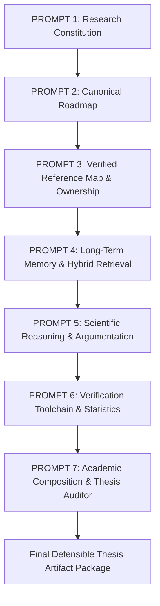

# End-to-End Scientific Research Workflow

## Complete System Lifecycle



## Step-by-Step Operator Guide

1. **Bootstrap & Health Check:**
   ```bash
   python -m research_agent.cli doctor
   ```
2. **Inspect Epistemic Node Status:**
   ```bash
   python -m research_agent.cli thesis node 1.3.3
   ```
3. **Execute Scientific Verification:**
   ```bash
   python -m research_agent.cli verify equation "(x + 1)**2" "x**2 + 2*x + 1"
   python -m research_agent.cli verify cm "[1, 0, 1, 0]" "[1, 0, 0, 0]"
   ```
4. **Draft Subsection:**
   ```bash
   python -m research_agent.cli thesis compose 1.3.3 --mode provisional
   ```
5. **Run Thesis-Wide Epistemic Audit:**
   ```bash
   python -m research_agent.cli thesis audit --mode provisional
   ```
6. **Compile Complete Publication & Thesis Build:**
   ```bash
   python -m research_agent.cli thesis build --mode provisional
   ```
7. **Trace Provenance Chain:**
   ```bash
   python -m research_agent.cli trace P-1.3.3-01
   ```
