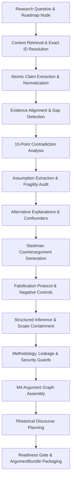

# Scientific Reasoning, Argumentation & Research Skills Architecture

**Document Version:** 1.0.0  
**Research Constitution Alignment:** RC-01 through RC-15  
**Core Hard Principle:** Prompt 5 builds the explicit ability to **REASON**, not write the thesis. Raw hidden chain-of-thought of LLMs is strictly non-canonical and prohibited as research truth. All reasoning steps are materialized as auditable, structured, typed scientific artifacts.

---

## 1. Architectural Overview & Explicit Reasoning Artifacts

The Scientific Reasoning Engine transforms heterogeneous inputs (Literature Sources, Empirical Evidence, Canonical Claims, Experimental Runs, Traceability Matrices) into **defensible research arguments** structured in an M4 Argument Graph and packaged into validated `ArgumentBundle` payloads.



### Explicit Reasoning Artifact Taxonomy
Every reasoning operation produces structured records conforming to Pydantic models in `src/research_agent/schemas/reasoning.py`:

| Explicit Artifact | Class Name | Schema Fields & Epistemic Role |
| :--- | :--- | :--- |
| **Premise / Atomic Claim** | `AtomicClaimCandidate` | `statement`, `original_wording`, `source_id`, `locator`, `scope`, `qualifiers`, `conditions` |
| **Evidence Gap** | `EvidenceGap` | `gap_id`, `claim_id`, `missing_evidence`, `why_required`, `suggested_experiment`, `severity`, `status` |
| **Assumption** | `AssumptionRecord` | `assumption_id`, `statement`, `is_explicit`, `testability`, `violation_consequence`, `status` |
| **Alternative Explanation** | `AlternativeExplanation` | `alt_id`, `explanation`, `confounder_type`, `affected_claim_id`, `test_or_control`, `likelihood` |
| **Counterargument** | `CounterargumentRecord` | `counter_id`, `objection`, `basis`, `affected_claim_id`, `severity`, `is_steelman`, `origin: OUR_COUNTERARGUMENT` |
| **Falsification Plan** | `FalsificationPlan` | `plan_id`, `target_hypothesis_id`, `potential_falsifying_observations`, `negative_controls`, `expected_outcomes` |
| **Structured Inference** | `InferenceRecord` | `inference_id`, `premises`, `evidence_ids`, `assumption_ids`, `justified_scope`, `candidate_conclusion`, `falsification_route` |
| **Argument Graph Node/Edge** | `ArgumentNode` / `ArgumentEdge` | Directed DAG connecting `CLAIM`, `EVIDENCE`, `ASSUMPTION`, `INFERENCE`, `COUNTERCLAIM`, `GAP` |
| **Discourse Plan** | `DiscoursePlan` | Rhetorical sequence of steps (`DiscourseFunction`) following 10 non-rigid argument patterns |
| **Argument Bundle** | `ArgumentBundle` | Gated, immutable research package handed off to writing stages upon passing all readiness criteria |
| **Verification Request** | `VerificationRequest` | Formal typed request for mathematical derivation, numerical checks, and statistical tests in Prompt 6 |

---

## 2. The 16 Canonical Reasoning Modes

The engine supports 16 distinct scientific reasoning modes (`ReasoningMode` enum in `core/enums.py`):

1. `DEFINITIONAL`: Delimiting precise mathematical/formal terminology and representation contract bounds.
2. `COMPARATIVE`: Trade-off analysis between competing architectural paradigms (e.g. parser-based vs parser-free).
3. `DEDUCTIVE`: Deriving necessary logical conclusions from axiomatic properties of representation transformations.
4. `INDUCTIVE`: Generalizing empirical patterns across bounded benchmark evaluations.
5. `ABDUCTIVE`: Inferring the most plausible architectural explanation for an observed anomaly or degradation.
6. `MECHANISTIC`: Tracing causal dataflow sequences through host operating system telemetry and model graph layers.
7. `COUNTERFACTUAL`: Reasoning about outcomes if specific parameter dictionaries or temporal windows were altered.
8. `CONTRADICTION_ANALYSIS`: 10-point multi-dimensional resolution of conflicting empirical claims in literature.
9. `FALSIFICATION`: Generating testable negative predictions capable of refuting hypotheses H1..H5.
10. `CAUSALITY_CHECK`: Validating that observational provenance dependencies are never inflated into causal claims.
11. `VALIDITY_ANALYSIS`: Auditing Construct, Internal, External, and Statistical validity factors.
12. `METHODOLOGY_CRITIQUE`: Adversarial review of experimental protocols for evaluation shortcuts and leakage.
13. `EVIDENCE_SYNTHESIS`: Thematic and mechanism-driven literature synthesis across consensus and disagreement clusters.
14. `HYPOTHESIS_EVALUATION`: Empirical grounding of H1..H5 into `SUPPORTED`, `PARTIALLY_SUPPORTED`, `CONTESTED`, or `FALSIFIED`.
15. `NOVELTY_DIFFERENTIATION`: Explicit 6-factor differentiation of candidate contributions from closest prior art.
16. `EXPERIMENT_INTERPRETATION`: Interpreting raw metrics via negative controls, frozen probes, and baseline comparisons.

---

## 3. Core Methodological, Security & Epistemic Guards

### 3.1 Provenance Causality Guard (`DEPENDS_ON != CAUSES`)
- **Principle:** System audit graphs represent observable dataflow and temporal event dependencies (`DEPENDS_ON`), not interventional causal mechanisms.
- **Enforcement:** `CausalityAuditor` flags causal verbs (`causes`, `leads to`, `determines`, `drives`) in observational contexts as `CAUSALITY_INFLATION`.

### 3.2 Security Taxonomy & Threat Model Guards
- **Anomaly != Attack (`ANOMALY_NOT_ATTACK`):** High anomaly scores on Tier A logs (HDFS, BGL) indicate operational or crash anomalies, not multi-stage APT cyberattacks.
- **Unusual != Malicious (`UNUSUAL_NOT_MALICIOUS`):** Legitimate administrative commands (PowerShell, PsExec, Nmap) are not inherently malicious without contextual process lineage and credential role analysis.
- **Representation != Detector Performance (`REPRESENTATION_NOT_DETECTOR`):** High end-to-end classifier accuracy does not prove feature representation superiority. Representation quality must be validated via a frozen linear probe under controlled capacity (Probe Operational Order DQ-01).

### 3.3 Privacy & Operational Reality Guards
- **Pseudonymization != Privacy (`PSEUDONYMIZATION_NOT_PRIVACY`):** Pseudonymization or identifier masking does not guarantee privacy against auxiliary linkage or Membership Inference Attacks (Shokri et al. 2017).
- **Offline Benchmark != SOC Deployable (`OPERATIONAL_OVERCLAIM`):** High offline batch detection F1 does not prove SOC deployability without bounded streaming memory footprint and throughput ($>100\text{k}$ EPS) under backpressure.

### 3.4 12-Point Data & Evaluation Leakage Checklist
The `LeakageAuditor` automatically audits experimental setups across 12 leakage pathways:
1. Parser (Drain/Spell) dictionary fitted on test partition.
2. Token vocabulary constructed with test tokens.
3. Feature scaling computed on full dataset instead of train-only.
4. Graph degree / centrality calculated across future temporal event windows.
5. Entity lookup dictionary contains test-set identifiers.
6. Classification threshold optimized directly on test ROC/PR curve.
7. Hyperparameters selected against test loss.
8. Probability calibration fitted on test instances.
9. Pretraining corpus ingested benchmark evaluation datasets.
10. Bi-directional message passing uses future event timestamps.
11. Synthetic campaign scenario IDs exposed to classifier.
12. Raw hostnames or IP addresses exposed without identifier masking.

### 3.5 10-Point Dataset Shortcut Checklist
The `ShortcutAuditor` flags representation dependencies on superficial artifacts:
- Executable paths, static usernames, fixed hostnames, campaign scenario IDs, static template IDs, unmasked process names, rare synthetic formatting tokens, ingestion artifacts.

---

## 4. Canonical Research Skills Library (18 Skills)

The engine equips the Research Agent with 18 versioned, executable research skills:

| Skill ID | Name | Category | Primary Function |
| :--- | :--- | :--- | :--- |
| **SKILL-01** | `claim_extraction_and_normalization` | REASONING_FOUNDATION | Extracts atomic propositional claims while preserving qualifiers and scope bounds. |
| **SKILL-02** | `evidence_alignment_and_gap_detection` | EVIDENCE_EVALUATION | Compares semantic entailment and flags open empirical evidence gaps. |
| **SKILL-03** | `structured_literature_synthesis` | SYNTHESIS | Organizes literature by issue and mechanism rather than paper lists. |
| **SKILL-04** | `contradiction_analysis_10pt` | DIALECTIC | Executes 10-point audit to identify true vs apparent contradictions. |
| **SKILL-05** | `implicit_explicit_assumption_audit` | METHODOLOGY | Identifies hidden assumptions and calculates violation consequences. |
| **SKILL-06** | `alternative_explanations_confounders` | METHODOLOGY | Generates 8 canonical confounders linked to negative controls. |
| **SKILL-07** | `falsification_negative_control_design` | EXPERIMENT_DESIGN | Designs empirical falsification protocols and discriminating tests. |
| **SKILL-08** | `steelman_counterargument_generation` | DIALECTIC | Constructs strongest plausible objections (`OUR_COUNTERARGUMENT`). |
| **SKILL-09** | `structured_research_inference` | INFERENCE | Builds justified inferences and enforces `conclusion_scope ⊆ justified_scope`. |
| **SKILL-10** | `causality_and_graph_inflation_guard` | AUDIT | Guards against causal inflation and enforces `DEPENDS_ON != CAUSES`. |
| **SKILL-11** | `data_and_evaluation_leakage_audit` | AUDIT | Executes 12-point data and test partition leakage checklist. |
| **SKILL-12** | `dataset_shortcut_learning_audit` | AUDIT | Audits feature extractors for superficial dataset shortcuts. |
| **SKILL-13** | `experimental_validity_4factor_audit` | AUDIT | Evaluates Construct, Internal, External, and Statistical validity. |
| **SKILL-14** | `hypothesis_and_rq_epistemic_evaluation` | EVALUATION | Grounded evaluation of H1..H5 without post-hoc hypothesis rescue. |
| **SKILL-15** | `contribution_novelty_differentiation` | NOVELTY | Differentiates CAND-01..CAND-15 from prior art (`OURS != NOVEL`). |
| **SKILL-16** | `m4_argument_graph_construction` | ARGUMENTATION | Constructs M4 Argument Graphs with cycle detection and visual exports. |
| **SKILL-17** | `rhetorical_discourse_planning` | DISCOURSE | Plans non-rigid argument packaging across 10 distinct patterns. |
| **SKILL-18** | `argument_bundle_packaging_and_readiness_gate` | PACKAGING | Assembles typed ArgumentBundle and executes multi-criteria gate. |

---

## 5. Rhetorical Patterns & Anti-Template Attractor Guard

To prevent repetitive, formulaic prose in thesis writing, the reasoning engine dynamically generates discourse plans using 10 diverse argument patterns:

1. `PROBLEM_MECHANISM_CONSEQUENCE`: Define problem $\to$ explain causal mechanism $\to$ bound consequence.
2. `CLAIM_EVIDENCE_QUALIFICATION`: State hypothesis $\to$ present empirical evidence $\to$ qualify operational bounds.
3. `METHOD_A_VS_METHOD_B_TRADEOFF`: Compare representations $\to$ contrast complexities $\to$ synthesize trade-off.
4. `ASSUMPTION_VIOLATION_FAILURE`: Define assumption $\to$ explain failure mode $\to$ counterargue $\to$ falsify.
5. `OBSERVATION_ALTERNATIVES_DISCRIMINATING_TEST`: Present result $\to$ differentiate alternatives $\to$ resolve conflict.
6. `PRIOR_WORK_LIMITATION_GAP`: Synthesize literature $\to$ delimit boundaries $\to$ motivate architecture.
7. `RESULT_ALTERNATIVE_CONTROL_INTERPRETATION`: Present empirical metrics $\to$ raise steelman objection $\to$ interpret via controls.
8. `BENEFIT_COST_BOUNDARY`: Explain mechanism $\to$ evaluate overhead $\to$ establish Pareto boundary.
9. `CLAIM_COUNTEREXAMPLE_REFINED_CLAIM`: State claim $\to$ introduce counterexample $\to$ refine proposition.
10. `EVIDENCE_LIMITATION_NARROWED_CONCLUSION`: Present evidence $\to$ state environmental limitation $\to$ narrow conclusion.

**Template Attractor Audit:** `DiscoursePlanner.audit_template_attractors` monitors cross-section plans and flags `TEMPLATE_ATTRACTOR_RISK` whenever 3 consecutive sections use identical rhetorical patterns.

---

## 6. Prompt 6 Verification Request Interface

The reasoning engine formalizes scientific verification requirements for mathematical derivations, numerical checks, and figure/table generation via typed `VerificationRequest` objects:

```python
class VerificationRequest(BaseModel):
    request_id: str
    request_type: VerificationRequestType  # EQUATION_VERIFY, NUMERICAL_CHECK, STATISTICAL_TEST, etc.
    target_claim_id: Optional[str]
    target_equation_id: Optional[str]
    target_table_or_figure_id: Optional[str]
    description: str
    input_payload: Dict[str, Any]
    status: VerificationRequestStatus  # PENDING, IN_PROGRESS, VERIFIED, REJECTED, FAILED
    verification_result: Optional[Dict[str, Any]]
```

These requests are stored in the SQLite database and queried during Prompt 6 for symbolic and statistical execution.

---

## 7. Reasoning Failure Modes (RF-01 .. RF-20) & Mitigations

| Failure Mode Code | Description | Automated Architectural Mitigation |
| :--- | :--- | :--- |
| **RF-01** | `UNSUPPORTED_CLAIM` | `EvidenceAlignmentEngine` flags missing empirical evidence and creates `EvidenceGap`. |
| **RF-02** | `OVERGENERALIZATION` | `InferenceEngine` enforces scope containment (`conclusion_scope ⊆ justified_scope`). |
| **RF-03** | `SCOPE_MISMATCH` | Scope extractor compares dataset and environmental boundaries between claim and evidence. |
| **RF-04** | `EVIDENCE_MISMATCH` | Alignment engine checks semantic entailment and metric compatibility. |
| **RF-05** | `OWNERSHIP_CONFUSION` | Reference Map Citation Firewall enforces 4-class boundary (`SOURCE`, `ADAPTED`, `OURS`, `BASELINE`). |
| **RF-06** | `CAUSALITY_INFLATION` | `CausalityAuditor` blocks causal language for observational findings and enforces `DEPENDS_ON != CAUSES`. |
| **RF-07** | `CONTRADICTION_IGNORED` | `ContradictionAnalyzer` executes 10-point checklist and preserves competing findings. |
| **RF-08** | `ASSUMPTION_UNTESTED` | `AssumptionAuditor` identifies implicit assumptions and measures testability. |
| **RF-09** | `ALTERNATIVE_UNTESTED` | `AlternativeExplanationsEngine` generates 8 standard confounders linked to negative controls. |
| **RF-10** | `LEAKAGE_RISK` | `LeakageAuditor` evaluates 12-point pretraining and normalization checklist. |
| **RF-11** | `SHORTCUT_RISK` | `ShortcutAuditor` detects environmental identifier learning (hostnames, paths). |
| **RF-12** | `BASELINE_UNFAIR` | `BaselineFairnessAuditor` checks that models share identical datasets, splits, and probe capacity. |
| **RF-13** | `METRIC_MISMATCH` | 10-point analyzer flags comparing precision against F1 or macro vs micro averages. |
| **RF-14** | `BENCHMARK_LIMITATION` | `ValidityAuditor` warns when evaluation is restricted to a single synthetic dataset. |
| **RF-15** | `PRIVACY_OVERCLAIM` | `SecurityGuards` blocks claiming privacy preservation based on pseudonymization alone. |
| **RF-16** | `OPERATIONAL_OVERCLAIM` | `SecurityGuards` blocks SOC deployability claims without streaming EPS throughput metrics. |
| **RF-17** | `NOVELTY_OVERCLAIM` | `ContributionDifferentiator` enforces `OURS != NOVEL` and requires closest prior work comparison. |
| **RF-18** | `REPRESENTATION_DETECTOR_CONFOUND` | Intrinsic probe requirement prevents attributing detector capacity to feature representation. |
| **RF-19** | `ATTACK_ANOMALY_CONFLATION` | `ValidityAuditor` prevents framing system crash logs (HDFS/BGL) as cyberattacks. |
| **RF-20** | `TEMPLATE_ATTRACTOR_COLLAPSE` | `DiscoursePlanner` audits argument diversity across 10 distinct rhetorical patterns. |
