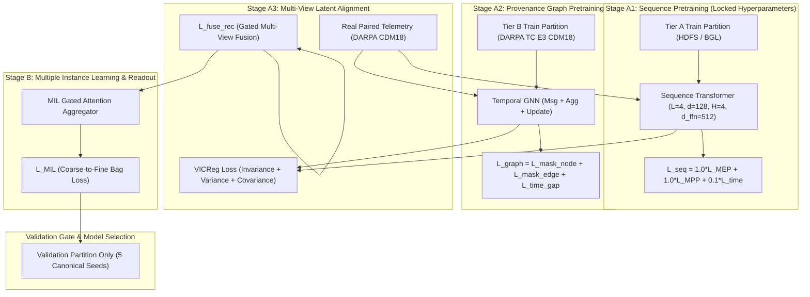

# CHAPTER 3 — REAL TRAINING DESIGN & DATASET-ROLE SPECIFICATION
**Protocol Status:** FROZEN PRE-EXECUTION DESIGN SPECIFICATION  
**Execution Status:** DESIGN ONLY (NO TRAINING INITIATED / TEST SEALED)  
**Document ID:** `SPEC-REAL-TRAINING-CH3-V1.2`  
**Repository:** `Minhlike/Chuyende`  
**Branch:** `train/ch3-stage-a1-preflight`

---

## 1. Scientific Principles & Dataset-Role Boundary (Claim Hygiene)

1. **Strict Test Set Firewall:** The Test partition for all datasets remains SEALED throughout architecture design, training stage implementation, and threshold tuning.
2. **Tier-A vs. Tier-B Evidential Boundary:**
   - **Tier A (HDFS LogHub & BGL):** Serves strictly as representation, template/parameter fidelity, and system-log anomaly context stress tests.
   - **CRITICAL HYGIENE:** HDFS/BGL logs **MUST NOT** independently establish cyberattack semantic fidelity, provenance attack semantics, or the final confirmatory claim for Hypothesis $H1$.
   - **Confirmatory Security Claims:** Any final security-semantic conclusion for $H1$ requires supporting Tier B evidence (DARPA TC E3) where ground-truth cyberattack and security behaviors are natively present.
3. **Role-Purity Invariant:** Synthetic proxy events from smoke tests MUST NEVER be reused in confirmatory experiments. Real multi-view experiments require genuine registered sequence $\leftrightarrow$ graph correspondence from native telemetry.
4. **Multi-Seed Protocol:** All empirical models must be evaluated across 5 canonical random seeds: `42`, `1337`, `2024`, `7`, `999`.

---

## 2. Dataset-Role Matrix

| Dataset | Tier | Canonical Role | Input Views | Evidential Boundary & Forbidden Usages |
| :--- | :---: | :--- | :--- | :--- |
| **HDFS LogHub** | Tier A | Sequence Representation ($z_{\text{seq}}$), Parameter Fidelity, System-Log Anomaly Detection Stress Test | Sequence View Only | MUST NOT be used as provenance graph or standalone security attack ground truth |
| **BGL Supercomputer** | Tier A | Long-Horizon Temporal Drift, Out-of-Vocabulary Robustness, Alert Log Stress Test | Sequence View Only | Alert tags are system alerts, MUST NOT be relabeled as cyberattacks |
| **DARPA TC E3** | Tier B | Temporal GNN ($z_{\text{graph}}$), Multi-View Alignment ($H2$), Provenance Graph Robustness, Real Attack Attribution ($H1$ Security) | Sequence + Provenance Graph Views | MUST NOT use synthetic event proxies; CDM18 raw ingestion required |
| **LANL Cyber** | Tier B | Identity & Authentication Linkability ($H5$), Controlled Linkability | Auth Event Sequences & Graph | MUST NOT fabricate ground-truth attack labels |

---

## 3. Real Training Stages Pipeline (Design Only)

---

## 4. Hardware Resource & Execution Regime (RTX 3050 Ti Laptop GPU)

- **Dedicated VRAM Ceiling:** 4096 MB (4.0 GB)
- **Host RAM Budget:** 16.0 GB
- **Sequence Transformer Training Regime (Stage A1):**
  - `micro_batch_size = 16`
  - `gradient_accumulation_steps = 4`
  - `effective_batch_size = 64`
  - `max_seq_len = 128`
  - `optimizer = AdamW (lr = 5e-4, weight_decay = 0.01)`
  - `warmup = 5% of total optimizer steps`
  - `validation_cadence = once per completed epoch`
  - `early_stopping_patience = 3 epochs`
- **Temporal GNN Training Regime (Stage A2):**
  - `micro_batch_size = 8`, `window_size = 200` causal interaction events
  - `gradient_accumulation_steps = 4` (effective batch size = 32)
- **Entity Memory Bank Management:**
  - `max_entities = 5000` per active stream with LRU eviction.
  - Active state payload bytes $\le 2.5 \text{ MB}$.

---

## 5. Prerequisites for Real Confirmatory Training
1. Acquisition and checksum verification of raw DARPA TC E3 CDM18 archives on drive `D:\Research\datasets\raw\darpa\e3\`.
2. Validation of ground-truth attack manifest mapping without inspecting sealed Test events.
3. Pre-execution configuration lock verified against `STAGE-A1-PREEXECUTION-LOCK.json`.
